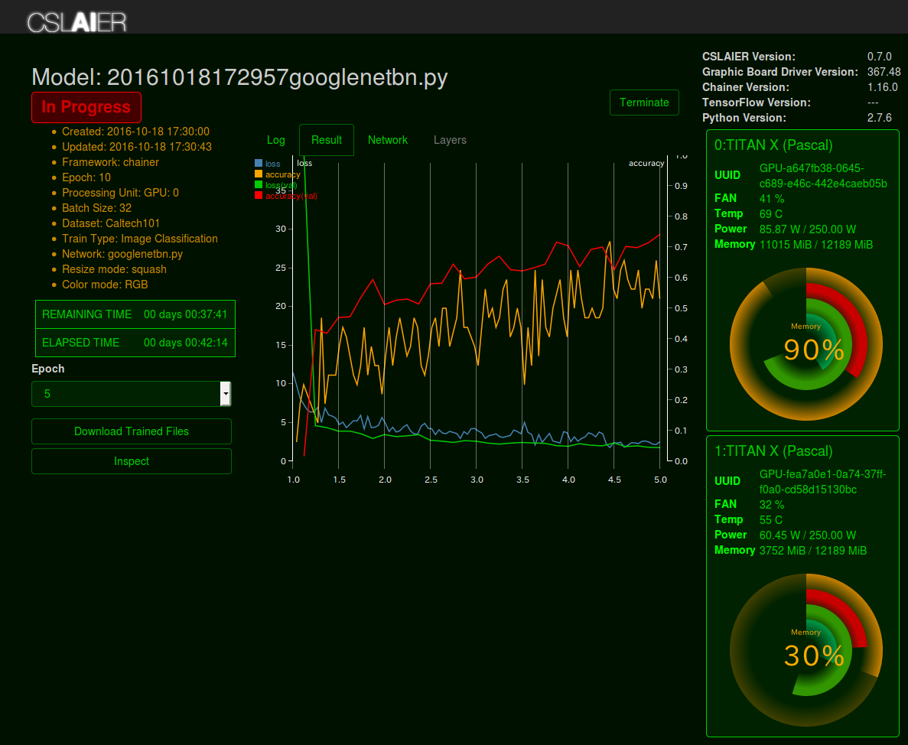
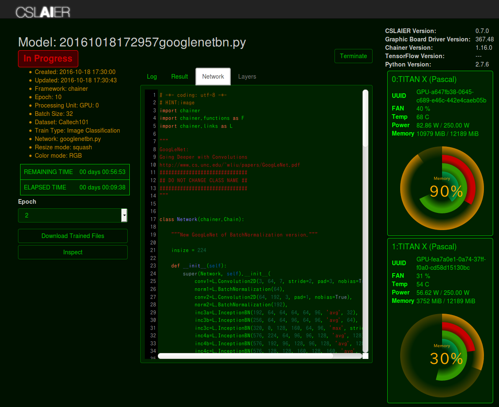
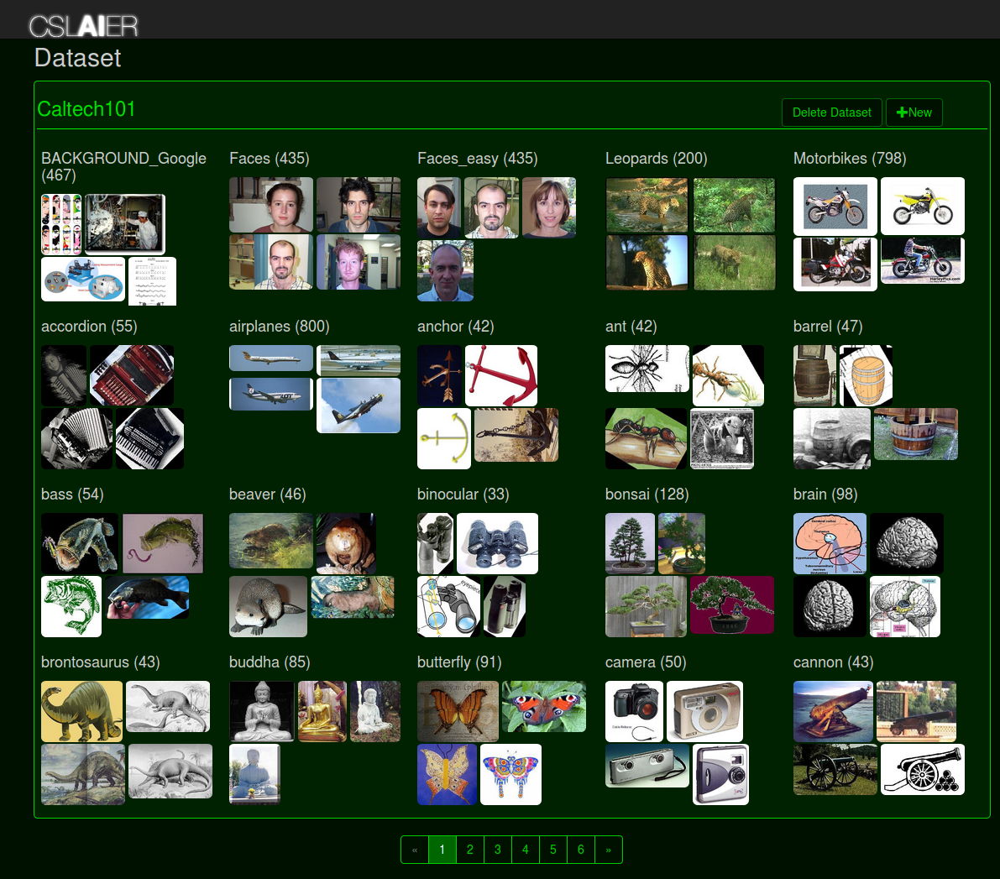

DEEPstation
============

DEEPstation version 0.4.2

Browser based GUI deep learning tool.

Screenshots
-------------

### Top page
#### Datasets

#### Modes

### Model detail page 
#### Train result

#### View and Edit model

### Dataset page

Requirement
------------

DEEPstation is tested on Ubuntu 14.04. We recommend them to use DEEPstation, though it may run on other systems as well.

### Supported Browsers

* Chrome
* Safari
* Firefox

### System
* NVIDIA CUDA Technology GPU and drivers 
* Python 2.7
  * python-opencv
  * python-scipy
* SQLite3
* nkf

### Python Libraries
* Chainer 1.5 http://chainer.org
* bottle
* bottle_sqlite
* cv2
* PyYAML
* matplotlib
* python-nkf

Setup
------

* Edit `settings.yaml` to set paths for saving files.
  * Begin with `/` stands for abosolute path.
  * Begin without `/` or begin with `./` stands for absolute path from DEEPstation's `main.py`. 
* Setup database. Try command below on root directory of DEEPstation.  
`sqlite3 deepstation.db < ./scheme/deepstation.sql`
* Startup server. `python main.py`
* Access `http://localhost:8080` on your browser.   
If you have changed hostname and port on `settings.yaml`, use that one.

### How to update

* Make backup `settings.yaml` and `deepstation.db`.
* Get newest code by `git pull` or something.
* Restore `settings.yaml` and `deepstation.db` from backup.
* Follow the instructions below as required.

#### Migration v0.2.1 to v0.3.0

* Stop DEEPstation by `ctrl + c`
* Run command below on root directory of DEEPstation  
`sqlite3 deepstation.db < ./scheme/migration_20160208.sql`
* Start DEEPstation.

#### Migration v0.3.0 to v0.4.0

* Stop DEEPstation by `ctrl + c`
* Run command below on root directory of DEEPstation  
`sqlite3 deepstation.db < ./scheme/migration_20160209.sql`
* Start DEEPstation.

#### Migration v0.4.x to v0.5.0

* Stop DEEPstation by `ctrl + c`
* Install `nkf` if you don't have yet.
* Install `python-nkf`. Using `pip intall nkf` is easy.
* Run command below on root directory of DEEPstation  
`sqlite3 deepstation.db < ./scheme/migration_20160314.sql`
* Start DEEPstation.

Usage
------

### Start up DEEPstation
* Move to DEEPstation's directory.
* Run `python main.py`.
* Access `http://localhost:8080` by web browser.

### Creating Dataset
* Upload dataset from '+new' button on Dataset section on top page. 
* Dataset is a zip file which contains classifeid images by directory like [Caltech 101](http://www.vision.caltech.edu/Image_Datasets/Caltech101/) dataset.

### Creating Model
* Make model from '+new' button on Models section on top page.
* Select network template from list.
* Edit it, if you want.
* Press 'Create' button. Then model is created and move to model detail page.

### Start Train
* Select created Model from top page.
* Press 'start train' button.
  * Fill in forms and start train.

### Inspection

* Move to 'Model' page.
* Chose 'Epoch' which you want to use for inspection.
* Press 'inspect' button.
* Select image(.jpg) for inspection.
* Press 'Submit'. Then you will see the result of inspection.

Tips
-----

### Cleaning up temporary files

Training makes a lot of temporary images on your `prepared_data` directory.  
If you want to remove these images, access `http://localhost:8080/cleanup` on your browser.  
It removes temporary images **IMMEDIATELY**.

### Changing server backend

You can change server backend (default is wsgiref). If you want to change, edit `settings.yaml`.  
You can chose server backend from [here](http://bottlepy.org/docs/dev/deployment.html#switching-the-server-backend)  
Use this functionality at your own risk.

License
--------

* MIT License

DEEPstation
============

ブラウザベースのGUI深層学習ツール

Requirement
------------

DEEPstationはUbuntu14.04でテストしています。 Ubuntu上で動かすことをおすすめしますが、他のプラットフォームでも動作します。

### Supported Browsers

* Chrome
* Safari
* Firefox

### System
* NVIDIA CUDA Technology GPU and drivers 
* Python 2.7
  * python-opencv
  * python-scipy
* SQLite3

### Python Libraries
* Chainer 1.5 http://chainer.org
* bottle
* bottle_sqlite
* cv2
* PyYAML
* matplotlib

Setup
------

* 各種ファイルの保存場所を`settings.yaml`に定義します。
  * `/` で始まるパスは絶対パスとして処理されます。
  * `/` で始まらないパス、`./`で始まるパスはDEEPstationの`main.py`が配置されているディレクトリ直下の相対パスとして処理されます。
* データベースのセットアップを行います。DEEPstationをダウンロードしたディレクトリで下記のコマンドを実行してください。  
`sqlite3 deepstation.db < ./scheme/deepstation.sql`
* サーバを起動します。DEEPstationをダウンロードしたディレクトリで `python main.py`を実行します
* ブラウザで `http://localhost:8080` にアクセスします。  
`settings.yaml`でhostnameとportを変更している場合はそちらを利用してください。

### Update時の注意点

* `settings.yaml`と`deepstation.db`のバックアップをとってください。
* `git pull`などで新しいソースコードを取得します。
* `settings.yaml`と`deepstation.db`をバックアップから復元します。
* 必要に応じて、以下のアップデート手順を実行します。

#### v0.2.1 から v0.3.0 へのアップデート方法

* DEEPstationを止めてください。DEEPstation実行中のターミナルで`ctrl + c`で止まります。 
* DEEPstationのルートディレクトリで下記のコマンドを実行してください。  
`sqlite3 deepstation.db < ./scheme/migration_20160208.sql`
* DEEPstationを起動してください。

#### v0.3.0 から v 0.4.0 へのアップデート方法

* DEEPstationを止めてください。DEEPstation実行中のターミナルで`ctrl + c`で止まります。 
* DEEPstationのルートディレクトリで下記のコマンドを実行してください。  
`sqlite3 deepstation.db < ./scheme/migration_20160209.sql`
* DEEPstationを起動してください。

#### v0.4.x から v 0.5.0 へのアップデート方法

* DEEPstationを止めてください。DEEPstation実行中のターミナルで`ctrl + c`で止まります。 
* `nkf`コマンドがインストールされていなければ、`nkf`コマンドをインストールしてください。
* `python-nkf`をインストールしてください。`pip install nkf`でインストールするのが簡単です。
* DEEPstationのルートディレクトリで下記のコマンドを実行してください。  
`sqlite3 deepstation.db < ./scheme/migration_20160314.sql`
* DEEPstationを起動してください。

使い方
------

### 学習の手順
1. Datasetの作成
2. Modelの作成
3. Modelの学習
4. Modelによる画像の予測結果の取得

### DEEPstationの起動
* DEEPstationをcloneしてきた場所に移動
* `python main.py` を実行
* ブラウザで`http://localhost:8080` にアクセスする

### Datasetの作成
* ディレクトリ毎にカテゴリ分けされた画像セットを用意し、zip形式に格納します。
  * ディレクトリは[Caltech 101](http://www.vision.caltech.edu/Image_Datasets/Caltech101/)のような構造になっている必要があります。
  * サブディレクトリ名が画像の予測結果の分類カテゴリーの名前になります。
* トップページのDatasetセクションにある'+new'ボタンを押し、Dataset Nameに任意のDataset名を記入します。
*　'ファイルを選択'ボタンで作成した画像セットをアップロードします。
* トップページのDatasetセクションにアップロードしたDatasetが追加されていれば、無事Datasetの作成は完了です。

### Modelの作成
* トップページのModelsセクションにある'+new'ボタンを押し、Model新規作成画面に移動します。
* Choose Network Template下のセレクトボックスで、任意のネットワークテンプレートを選択します。
  * 必要であればModel名やNetwork名を変更します。
  * 中央に表示されるエディタでModelの編集が可能です。編集しないでも動作します。
* 下段の'Create'ボタンを押すとModelが作成され、Modelの詳細画面に遷移します。
  * 左上に表示されている'DEEPstation'ロゴを押すと、トップページに遷移します。
* トップページのModelsセクションに作成したModelが追加されていれば、無事Modelの作成は完了です。

### 作成したModelからの学習
* トップページのModelsセクションから学習に利用するModelを選択し、Modelの詳細画面に移動します。
* 'start train'ボタンを押し、使用するDataset、学習させるEpock(世代)の数、使用するGPUのIDを選択します。
* 'Start'ボタンで学習が開始され、Modelのステータスが'In Progress'に切り替わります。
* Modelのステータスが`In Progress'から'Trained'に切り替われば、無事Modelの学習は完了です。
  * 注:使用するDataset、学習させるEpoch(世代)の数、使用するGPUの種類と数によって学習にかかる時間は大きく変化します。

### 学習済Modelによる画像の予測(inspection)
* トップページのModelsセクションから学習済みModel('Trained'となっているModel)を選択し、Modelの詳細画面に移動します。
* Epock下の入力ボックスで予測に利用するEpoch(世代)を指定します。
* 'inspect'ボタンを押します。
* 予測させたい画像を選択します。
* 'Submit'ボタンを押すと、予測結果が表示されます。

Tips
-----

### Datasetの編集について
####　画像の追加と削除
* トップページのDatasetセクションから編集するDatasetを選択して、Datasetの詳細画面に移動します。
* Datasetの詳細画面内で編集するカテゴリー選択して、カテゴリーの詳細画面に移動します。
* **画像を追加する場合:** カテゴリーの詳細画面内の'+New'ボタンを押し、'ファイルを選択'ボタンで追加したい画像をアップロードします。
* **画像を削除する場合:** カテゴリーの詳細画面内にある削除する画像をクリックして、'OK'ボタンを押します。

####　カテゴリーの追加と削除
* トップページのDatasetセクションから編集するDatasetを選択して、Datasetの詳細画面に移動します。
* **カテゴリーを追加する場合:** Datasetの詳細画面内の'+New'ボタンを押し、カテゴリー名を指定してカテゴリーを作成します。
* **カテゴリーを削除する場合:** 削除するカテゴリー選択して、カテゴリーの詳細画面に移動します。'Delete Category'ボタンを押して、'OK'ボタンを押します。

####　Datasetの削除
* トップページのDatasetセクションから編集するDatasetを選択して、Datasetの詳細画面に移動します。
* 'Delete Dataset'ボタンを押して、'OK'ボタンを押します。

####　Datasetのディレクトリを直接編集する
* Datasetのディレクトリの中身は直接編集することが可能です。ただしディレクトリ自体のパスは変更しないでください。

### Modelの編集について
####　Modelの編集
* トップページのModelsセクションから編集したいModelを選択し、Modelの詳細画面に移動します。
* 'Network'タブを押し、表示されるエディタからModelを編集します。
* 'Create'ボタンを押して、Model名やNetwork名を指定し、編集を終了します。
   * 注:編集したModelは別のModelとして新規作成されます。

####　Modelの削除  
 * トップページのModelsセクションから削除したいModelを選択し、Modelの詳細画面に移動します。
 * 'Delete'ボタンを押すと選択されたModelが削除されます。
   * 注: 学習済のモデルも一緒に削除されます。

### 経過グラフについて
Modelの詳細画面内の'Result'タブを押すと学習の経過グラフが表示され、学習の経過を確認することができます。  
学習中のModel('In Progress'となっているModel)の場合は経過グラフが随時更新されていきます。

#### 経過グラフの各線分

|名前|線分の色|意味|
|---|---|---|
|loss|青|誤差|
|accuracy|オレンジ|正確性|
|loss(val)|緑|学習中の誤差 |
|accuracy(val)|赤|学習中の正確性|

横軸はEpoch数です。

### 学習が完了したModelの利用
Modelの詳細画面内の'Downlord Model'ボタン、'Downlord Label'ボタン、'Downlord Mean File'ボタンからそれぞれ学習済みModel、Label(カテゴリの一覧)、Mean Fileをダウンロードすることができます。  
他のプログラムからの利用方法は[サンプル](./examples/inspection/)を参照ください。

### setting.yamlの編集について

#### 各種ファイルの保存場所を変更する
* setting.yamlを編集し、保存場所のパスを変更します。
* サーバーを再起動します。

#### 外部のマシーンからアクセスする
* settings.yamlを編集し、ホストとポートを指定します。
* サーバーを再起動します。
* DEEPstationが動いている以外のマシンでブラウザより、settings.yamlに指定したURLにアクセスし、DEEPstationの画面が開いたら成功です。

### 一時ファイルの削除

学習ではたくさんの一時ファイルを`prepared_data`ディレクトリに作成します。  
もし、これらの画像を削除したい場合は `http://localhost:8080/cleanup` にブラウザでアクセスします。 
すると、作成された一時ファイルが **ただちに** 削除されます。

### サーバのバックエンドの変更

実行するサーババックエンドを変更することができます(デフォルトではwsgirefが選択されています)。  
`settings.yaml` に使用するサーババックエンドを指定することで変更することができます。  
使用できるバックエンドは [このリスト](http://bottlepy.org/docs/dev/deployment.html#switching-the-server-backend) の中から選択することができます。  
サーバのバックエンドを変更する場合は自己責任で行ってください。

License
--------

* MIT License
